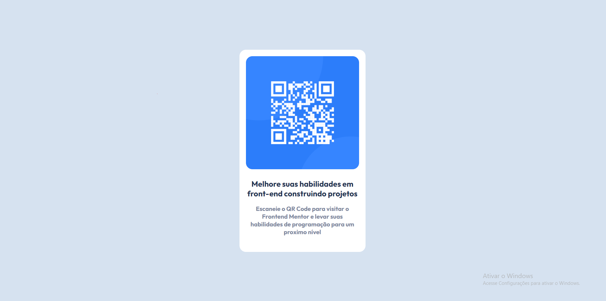

# Frontend Mentor - QR code component solution

E aqui está a minha solução do [QR code component challenge on Frontend Mentor](https://www.frontendmentor.io/challenges/qr-code-component-iux_sIO_H).

## Tabela de conteúdos

- [Overview](#overview)
  - [Como ficou](#foto-do-resultado)
- [Processo](#processo)
  - [Feito com](#feito-com)
  - [O que eu aprendi](#o-que-eu-aprendi)
- [Autor](#autor)
- [Agradecimentos](#agradecimentos)


## Overview

### Foto do resultado


***O "Ativar o Windows" do lado ali é por puro charme xD***


## Processo

### Feito com

- Semantic HTML5 markup
- CSS custom properties
- Flexbox
- Google Fonts

### O que eu aprendi

**Como iniciar um projetinho**

  Olha... devo admitir que quando comecei a fazer este projeto, me perdia muito na parte de "como começar". Aprendi então de uma forma bem interessante como "ler" o tamplate e usa-lo ao meu favor. Foi um pontapé muito importante pra mim.
  
**"Por que meu conteúdo não desce??"**

  Tive um problema muito chato enquanto fazia meu projeto kkkk: ***O conteúdo simplesmente se negava a descer!***. Depois de uma assistencia, descobri que na verdade o problema estava nas medidas fixas e dinamicas do meu projeto.

**Flexbox**

  Aprendi também sobre a Flexbox e aonde devo colocá-la
 ```
 .content{
    display: flex;
    justify-content: center;
    align-items: center;
    height: 100%;
    
}
.container{
    display: flex;
    flex-direction: column;
    justify-content: center;
    align-items: center;
    width: 350px;
    text-align: center;
    padding: 20px;
    background-color: white;
    border-radius: 20px;
  ```

**Nota:**
  Recaptulei também alguns conceitos que eu tinha me esquecido por conta da falta de pratica, como ***Vh***, ***Hierarquia***, ***efeito cascata*** entre outros. Acontece haha.


## Autor

- Frontend Mentor - [@natanepirisso](https://www.frontendmentor.io/profile/natanepirisso)
- Instagram - [@natanepirisso](https://www.instagram.com/natanepirisso/)


## Agradecimentos

Um agradecimento especial pro viniciusorisso que me ajudou não a fazer, mas a pesquisar e a ter um raciocinio lógico dentro dos trambites do projetinho. Valeu rapaze :)
